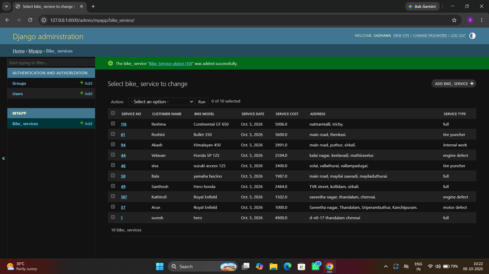

# Ex02 Django ORM Web Application
## Date: 06.10.2026

## AIM
To develop a Django Application to store and retrieve data from a Vehicle Service Database platform using Object Relational Mapping(ORM).


## DESIGN STEPS

### STEP 1:
Clone the problem from GitHub

### STEP 2:
Create a new app in Django project

### STEP 3:
Enter the code for admin.py and models.py

### STEP 4:
Detect changes and create migration files that describe how to modify the database schema

### STEP 5:
Execute the migration files and update the database schema to match your Django models

### STEP 6:
Create a superuser with full access rights to all models and data through the admin interface.

### STEP 7:
Apply the migration files of the created app to the database

### STEP 8:
Execute Django admin using localhost and create details for 10 entries

## PROGRAM
```
models.py
from django.db import models
from django.contrib import admin

class Bike_Service(models.Model):
    Service_No = models.IntegerField()
    Customer_Name = models.CharField(max_length=20)
    Bike_Model = models.CharField(max_length=20)
    Service_Date = models.DateField()
    Service_Cost = models.FloatField()
    Address = models.TextField()
    Service_Type = models.CharField(max_length=30)

class Bike_ServiceAdmin(admin.ModelAdmin):
    list_display=["Service_No","Customer_Name","Bike_Model","Service_Date","Service_Cost","Address","Service_Type"]


admin.py
from django.contrib import admin
from .models import Bike_Service,Bike_ServiceAdmin
admin.site.register(Bike_Service, Bike_ServiceAdmin)

```


## OUTPUT



## RESULT
Thus the program for creating Online Food Delivery Database using ORM hass been executed successfully
